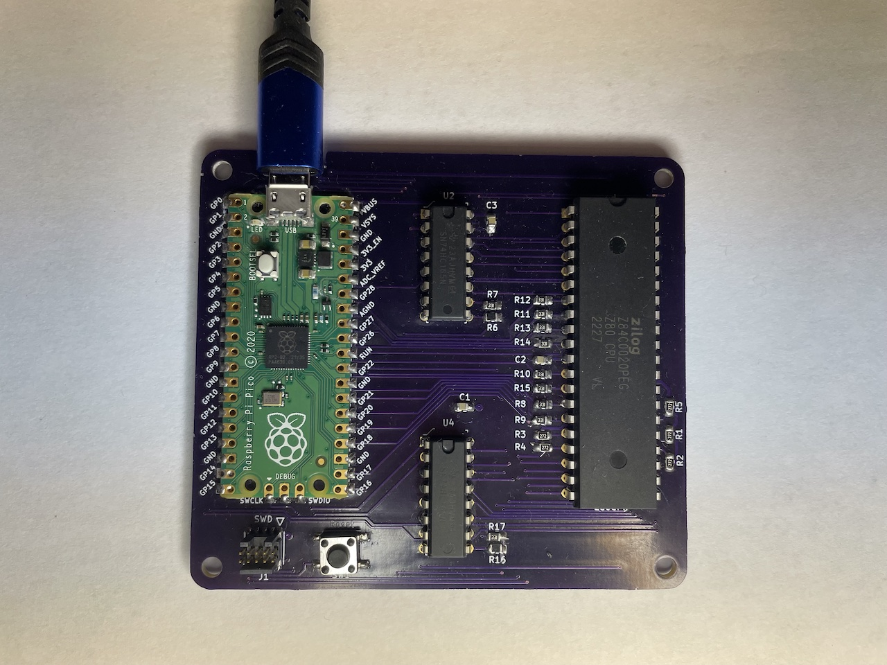
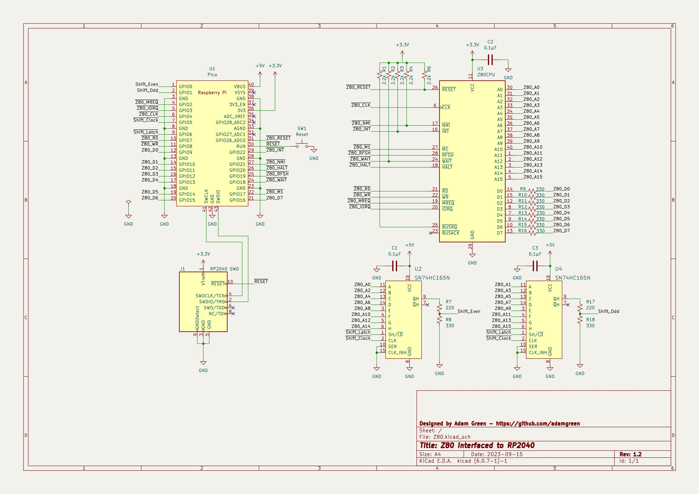
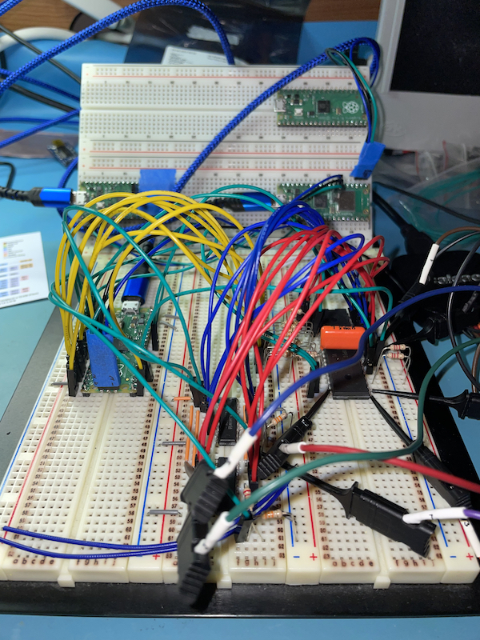
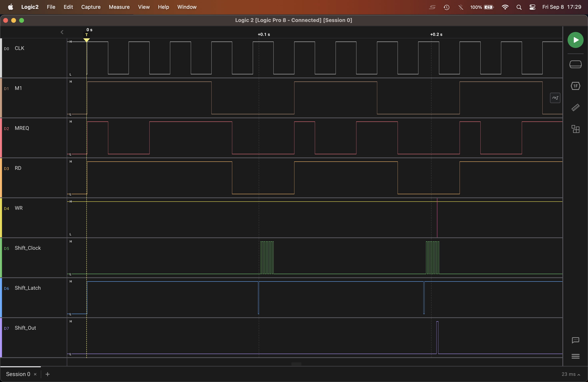
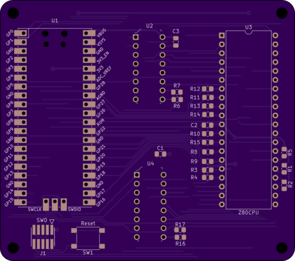

# Z80 Diversion


This project is a [Z80](https://www.zilog.com/index.php?option=com_product&Itemid=26&task=docs&businessLine=&parent_id=139&familyId=20&productId=Z84C00) based single board computer. A [RP2040 microcontroller](https://www.raspberrypi.com/documentation/microcontrollers/rp2040.html) is also included on the board. It is connected to the Z80 bus to:
* Provide the Z80 access to 64k of its 264k of SRAM.
* Allow a [Z80 compatible version of GDB](https://github.com/b-s-a/binutils-gdb) to debug the Z80 over a USB serial connection. The RP2040 is used as a hardware debugger for the Z80 much like modern JTAG or SWD probes (ie. Segger J-Link).


## Project Purpose
I want to verify some unit tests which exercise all of the instructions supported by the Z80 microprocessor. These tests can be used to verify Z80 emulation. Having the ability to also runs these tests against real Z80 hardware is desireable as it allows verifying the quality of the tests themselves. A few years ago, I did something similar for the ARMv6-M instruction tests that I wrote for my [pinkySim project](https://github.com/adamgreen/pinkySim).


## Project Progression
* The Z80, RP2040 Pico, and SN74HC165 shift register devices arrived from Digikey.
* I completed the initial schematic in KiCAD.
* I wired up an initial test version on my breadboard.
* I wrote simple proof of concept PIO and ARM code for the RP2040 to verify my hardware setup.
* I completed the initial PCB design in KiCAD.
* I ordered and received PCBs from [OSHPark](https://oshpark.com).
* I was able to download a [Z80 port of binutils/GDB](https://github.com/b-s-a/binutils-gdb) and build it on my Mac.
* I soldered up one of the PCBs and successfully tested it out with the code that I had previously developed.
* I simplified the PIO state machine code and got it running faster:
  * Can run the Z80 at 500kHz without requiring any wait cycles.
  * Can run the Z80 at faster clock rates (at least 5MHz) reliably but requires wait cycles as the RP2040 takes time to wait for the shift registers and respond to memory read/write requests.
* My [MRI core](https://github.com/adamgreen/mri) has been extended to handle debug targets which aren't just 32-bit. This will allow 64-bit in the future and 16-bit for Z80 debugging.
* The Z80 version of GDB is now able connect to the board via a RP2040 USB based serial connection to:
  * Examine and modify the Z80's 64k of RAM (which is actually a 64k global buffer on the RP2040).
  * Examine and modify the Z80's registers.
  * Single step the Z80.
  * Set up to 4 Code Breakpoints.
  * Set up to 2 Data Watchpoints
  * Z80 reset from GDB.


## Reading List
<br>
It has been around a decade since I last looked at the Z80 so I had to skim through a few Z80 references to refresh my memory of what it takes to interface this little guy to the outside world. These references included:
* [Build Your Own Z80 Computer by Steve Ciarcia](https://en.wikipedia.org/wiki/Build_Your_Own_Z80_Computer) ([Free PDF](http://www.pestingers.net/pdfs/other-computers/build-your-own-z80.pdf)).
* [Z80 CPU User Manual](https://www.zilog.com/docs/z80/UM0080.pdf)
* [Z80 Product Specification](https://www.zilog.com/docs/z80/ps0178.pdf)
* [Other Official Z80 Documents](https://www.zilog.com/index.php?option=com_product&Itemid=26&task=docs&businessLine=1&parent_id=139&familyId=20&productId=Z84C00)

I also skimmed some RP2040 documentation again as well to make sure that I had a good chance of successfully interfacing it to the Z80 before going too far down that path:
* [Raspberry Pi Pico Datasheet](https://datasheets.raspberrypi.com/pico/pico-datasheet.pdf)
* [RP2040 Datasheet](https://datasheets.raspberrypi.com/rp2040/rp2040-datasheet.pdf)


## High Level BOM
This board includes:
* A **Z80 Microprocessor** - I am using a [Z84C0020PEG](https://www.digikey.com/en/products/detail/zilog/Z84C0020PEG/928994) device since it is:
  * 20 MHz capable. I picked the fastest CMOS version of the device available. It can run at 20MHz when powered by a 5V supply but it should be able to run at a lower 3.3V (same as the RP2040) when clocked at lower frequencies (between 1 and 2.5 MHz).
  * 40-pin DIP package. Currently Digikey only has the DIP version of the 20MHz capable part in stock. I would have preferred the LQFP SMD version but it doesn't look like it will be in stock for awhile. It did make early bread boarding possible though.<br>
* A [RP2040 based Pico](https://www.digikey.com/en/products/detail/raspberry-pi/SC0915/13624793). This is connected to the Z80 bus and used to service Z80 memory requests. It also functions as a hardware debugger for the Z80. Features of the RP2040 that have been leveraged for this project include:
  * USB 1.1 controller and PHY. This allows for easy connection to a desktop/laptop. GDB can be used to program and debug the Z80 over this USB connection.
  * 264kB SRAM. 64kB of this is used to service memory read/write requests from the Z80.
  * 2MB of FLASH. Lots of room for the required firmware and storage of any ROM images that we may want to use with the Z80.
  * Programmable I/O. This was useful for interfacing with the Z80 bus without bit banging everything from the CPU.
  * Dual core Cortex-M0+ cores. Allowed dedicating a core to just servicing memory read/writes requests from the Z80. This way things like USB interrupts don't introduce random delays.
  * The Pico has the required voltage regulation to allow the board to be powered directly from USB.<br>
* 2 x [SN74HC165 8-bit shift registers](https://www.digikey.com/en/products/detail/texas-instruments/SN74HC165N/376966). This is used to latch the 16-bit address sent from the Z80 and push it into the RP2040 over 2 serial lines, one for the even bits and the other for the odd bits. I run this chip at 5V and run the serial outputs through a 3/5 voltage divider to make it compatible with the RP2040 while also allowing it to run faster. The voltage divider did end up slowing down the rise/fall times but running it at 3.3V slowed it down even more. I ended up clocking the shift registers at ~15MHz with an asymmetric clock. I hold it high for longer so that the output has time to stabilize before I sample it from the RP2040 on the falling clock edge. I would like to switch to a faster shift register in future revisions.<br>


## Programmable I/O
One of the coolest features of the RP2040 is its Programmable I/O (PIO). If you look at the block diagram of many peripherals on a microcontroller, you tend to see the same parts: inbound and outbound FIFOs, shift registers, pin I/O, and a **state machine**. The PIO has all of the same parts except that its state machine is programmable.

I leverage the programmable I/O (PIO) peripheral on the RP2040 for interfacing to the Z80 bus. I use 2 PIO state machines for this interfacing:
* The first state machine, ```AddressStateMachine```, samples the **MREQ'** / **IOREQ'** signals and shifts out the 16-bit address bits using two 8-bit shift registers:
  * It pauses if it sees **RFSH'** asserted (pulled low) since those requests are just for refreshing DRAM which can be safely ignored. Once this signal is de-asserted the state machine starts running again.
  * If it sees either of the **MREQ'** or **IOREQ'** signals go active (pulled low) then it asserts the **WAIT'** signal to let the Z80 know that it needs to wait for the RP2040 to access the requested data.
  * It will then latch the 16-bit address bits and start shifting out the address, two bits at a time.
  * Once the 16-bit address has been fully shifted in, it will be pushed to the RX FIFO for the CPU to pick up.
  * The state machine will then wait for the CPU to send back the PIO instruction that either waits on the **MREQ'** or **IOREQ'** signal being de-asserted.
  * Before executing the wait instruction it de-asserts the **WAIT'** signal to let the Z80 know that the request has been completed.
  * It then waits for the **MREQ'** or **IOREQ'** signal to be de-asserted (pulled high again) before looping around and looking for the next request. The CPU assembles the correct ```WAIT 1 GPIO n``` instruction and sends it down to the PIO state machine via its TX FIFO.
* The other state machine, ```ReadWriteStateMachine```, samples the **RD'**/**WR'** signals to determine if a read or write memory transfer is being requested by the Z80:
  * It keeps sampling the **RD'**/**WR'** signals until it sees one of them go active (pulled low).
  * The state of the **RD'**, **WR'**, **D0** - **D7** and **M1'** lines are then transferred to the CPU so that between this data and the 16-bit address from the other state machine, the CPU has enough information to perform the memory request.
  * The state machine will then wait for the CPU to send back the required response. This will include bits needed for setting **D0**-**D7** to the correct input/output state, the requested byte if a read request was made, bits to set **D0**-**D7** back to input only, and a PIO instruction that waits on the **RD'** or **WR'** signal being de-asserted.


## Current Pin Map
The PIO state machines place constraints on some signals as they will need to be mapped to consecutively numbered GPIO pins so that they can be shifted in/out as a unit. This is how the pins ended up being mapped between the RP2040 and Z80:
| RP2040 | Z80 / Shift | PIO Pin Group    | Notes |
|--------|-------------|------------------|-------|
| GP0  | Shift_In_Even | Input            | |
| GP1  | Shift_In_Odd  | Input            | |
| GP2  | MREQ'         | Input            | |
| GP3  | IOREQ'        | Input            | |
| GP4  | CLK           | Set              | |
| GP5  | Shift_Clock   | Side Set         | |
| GP6  | Shift_Latch   | Side Set         | |
| GP7  | RD'           | Input            | |
| GP8  | WR'           | Input            | |
| GP9  | D0            | Input/Output     | |
| GP10 | D1            | Input/Output     | |
| GP11 | D2            | Input/Output     | |
| GP12 | D3            | Input/Output     | |
| GP13 | D4            | Input/Output     | |
| GP14 | D5            | Input/Output     | |
| GP15 | D6            | Input/Output     | |
| GP16 | D7            | Input/Output     | |
| GP17 | M1'           | Input            | |
| GP18 | WAIT'         | Set              | 2.2kΩ Pull-Up |
| GP19 | RFSH'         | WAIT GPIO        | |
| GP20 | HALT'         | Input / Non-PIO  | |
| GP21 | NMI'          | Output / Non-PIO | 2.2kΩ Pull-Up |
| GP22 | INT'          | Output / Non-PIO | 2.2kΩ Pull-Up |
| GP26 | RESET'        | Output / Non-PIO | 3 CLK Long Pulse (3µs @ 1MHz) |
| N/C  | BUSREQ'       | Not Connected    | 2.2kΩ Pull-Up |


## Current Schematic
<br>
After wiring up this circuit on a breadboard, I found that things worked better if I made some changes to my original schematic:
* I originally thought it would work best to shift in the Z80 address bit pairs in from least significant to most significant. This results in the CPU receiving the address in the upper 16 bits and the **MREQ'** and **IOREQ'** signals values in bits 14-15. It would be nicer if the address bits were in the lower 16-bits where they can be easily masked off and used. Doing the shifts in this order required me reversing the order of the Z80 address bit connections to each of the shift registers.
* I added 0.1µF bypass capacitors to the IC power supply lines.
* I discovered that the SN74HC165 shift registers didn't have output rise and fall times that were consistent with running them at 50MHz even though I was supplying them with 5V.
  * The high resistance voltage divider I had in the original schematic to level shift this output made the problem worse.
  * Reducing the voltage divider from 55kΩ to 550Ω did shorten the rise and fall times but not enough to work at 50MHz. It does work up to 15MHz now though.
  * If I switch to SMD parts then I think there are variants of the 74*165 shift registers that can run at 3.3V and give the desired <= 10ns rise/fall times. I may try this in the future but I will just use the parts that I already have for now.
* I also wanted to test that the Z80 runs reliably at 3.3V with lower clock rates. The Z80 didn't hit any issues running NOPs at 400kHz on this breadboard setup. After I rewrote the PIO code when working with the PCB version of this circuit I was able to run it successfully at 5MHz.
* I removed the 330Ω pull-up resistor from the **CLK** signal. It was needed for TTL clocking circuits used with the older NMOS version of the Z80. I am using a CMOS version of the Z80 and driving **CLK** directly from a pin of the CMOS based RP2040 microcontroller so it isn't needed anymore.



The screenshot below shows some early traces from my logic analyzer as I began to get the Z80 successfully starting up on the breadboard above and executing NOPs supplied by the RP2040.




## PCB Design version 1.1
<br>
I completed the initial PCB design and sent it off to OSHPark to have it fabricated. It was a lot easier to work with this board than the previous mess of wires I had on my breadboard.

### Issues Discovered in Version 1.1 PCB
After soldering up the first of the version 1.1 PCBs I encountered an issue:
* When soldering the Raspberry Pi Pico to the PCB as a surface mount part there isn't enough clearance between the bottom of the USB connector on the Pico and my PCB.
  * I had to file out a groove to have it work with my USB cable on the first board I soldered up since I had already soldered the Pico down flat to the PCB surface.
  * On subsequent assemblies of this version of the PCB I will use male headers to mount the Pico as a through hole part (the footprint allows both SMD and through hole mounting). This will lift the Pico up off of the PCB to make room for the USB cable housing.
  * If I make another version of this PCB, I will align the Pico's USB connector with the edge of the PCB to eliminate this issue.


## GDB for Z80
I have past experience with using GDB and GDB debug stubs to debug Cortex-M microcontrollers. I leveraged this experience to support GDB debugging of the Z80 on this board. When I tested my ARMv6-M instruction tests on real Cortex-M hardware, I used an existing GDB debug stub and modified my test harness to pretend to be GDB so that it could place required inputs and code into RAM, setup the registers, single step over the test instruction, and then interrogate memory and registers afterwards to verify that the expected side effects occurred. I can now do the same for the Z80 using this project.

I found the following page on the web and it had lots of great information on how to use GDB with the Z80:
* [chciken's TLMBoy: Implementing the GDB Remote Serial Protocol](https://www.chciken.com/tlmboy/2022/04/03/gdb-z80.html)

### Building GDB for Z80
I have been able to download and build the same Z80 fork as @chciken:
* ```git clone https://github.com/b-s-a/binutils-gdb.git z80-gdb```
* Apply the following diff to allow the Z80 version of GDB to handle SP being set to 0x0000:
```diff
diff --git a/gdb/z80-tdep.c b/gdb/z80-tdep.c
index 641af5e06c..42f04c49f0 100644
--- a/gdb/z80-tdep.c
+++ b/gdb/z80-tdep.c
@@ -663,6 +663,7 @@ z80_frame_unwind_cache (struct frame_info *this_frame,
       /* Assume that the FP is this frame's SP but with that pushed
         stack space added back.  */
       this_base = get_frame_register_unsigned (this_frame, Z80_SP_REGNUM);
+      if (this_base == 0x0000) this_base = 1 << gdbarch_ptr_bit(gdbarch);
       sp = this_base + info->size;
       if (this_base < sp_min || sp > sp_max)
          return info;
```
* ```brew install texinfo```
* ```cd z80-gdb```
* ```mkdir build/```
* ```cd build/```
* ```LDFLAGS=-Bstatic ../configure --target=z80-unknown-elf --disable-werror --prefix=$(pwd) --exec-prefix=$(pwd)```
* ```make```
* **Note:** I don't have ```make install``` working on macOS yet. Until then, the GDB binary can be found as ```z80-gdb/build/gdb/gdb```

### Using GDB for Z80
This section shows a few snippets from an example GDB session where it is attached to my Z80 board and uses them to explain some of the debug operations supported by my firmware.

* First I will start the Z80 version of GDB that I talked about building up above. It instructs GDB to connect to a remote target using a virtual serial port, ```/dev/cu.usbmodem111301``` on my machine. GDB will give a warning about ```"No executable has been specified and target does not support determining executable automatically."``` because no .ELF file was provided. This means we have no symbols but we can still look at the low level assembly instructions, Z80 registers, and memory contents to figure out what our program is doing.
* The firmware in my board is currently written so that it loads a little test program into memory at address 0, where the Z80 starts executing upon power up, hardware reset, and ```RST 0``` commands. This sample program loads known values into all of the registers.
* The current debugger firmware also halts the Z80 when it comes out of reset, before it can even execute the first instruction at address 0x0000.
* The first command I give GDB is ```x/24i 0x0000``` This asks GDB to dump the first 24 **i**nstructions starting at address 0x0000.
  * The disassemble instruction doesn't work because it requires symbols to know where a function starts and we don't have a .ELF to provide those symbols.
  * This lets us see the contents of the test program used to load known values into the registers.
```
~/depots/Z80-Diversion$ ~/depots/z80-gdb/build/gdb/gdb -ex "set target-charset ASCII" -ex "set remotelogfile z80_mri.log" -ex "target remote /dev/cu.usbmodem111301"
GNU gdb (GDB) 10.0.50.20200317-git
Copyright (C) 2020 Free Software Foundation, Inc.
License GPLv3+: GNU GPL version 3 or later <http://gnu.org/licenses/gpl.html>
This is free software: you are free to change and redistribute it.
There is NO WARRANTY, to the extent permitted by law.
Type "show copying" and "show warranty" for details.
This GDB was configured as "--host=arm-apple-darwin22.6.0 --target=z80-unknown-elf".
Type "show configuration" for configuration details.
For bug reporting instructions, please see:
<http://www.gnu.org/software/gdb/bugs/>.
Find the GDB manual and other documentation resources online at:
    <http://www.gnu.org/software/gdb/documentation/>.

For help, type "help".
Type "apropos word" to search for commands related to "word".
Remote debugging using /dev/cu.usbmodem111301
warning: No executable has been specified and target does not support
determining executable automatically.  Try using the "file" command.
0x00000000 in ?? ()
(gdb) x/24i 0x0000
=> 0x0:	ld sp,0x0000
   0x3:	ld a,0x14
   0x5:	ld i,a
   0x7:	ld a,0x15
   0x9:	ld r,a
   0xb:	ld bc,0x0001
   0xe:	push bc
   0xf:	pop af
   0x10:	ld bc,0x0203
   0x13:	ld de,0x0405
   0x16:	ld hl,0x0607
   0x19:	ld ix,0x0809
   0x1d:	ld iy,0x0a0b
   0x21:	exx
   0x22:	ex af,af'
   0x23:	ld bc,0x0c0d
   0x26:	push bc
   0x27:	pop af
   0x28:	ld bc,0x0e0f
   0x2b:	ld de,0x1011
   0x2e:	ld hl,0x1213
   0x31:	ex af,af'
   0x32:	exx
   0x33:	jr 0x0033
```

* The next command I send to GDB is ```info reg``` to dump all of the Z80 registers at once. This version of GDB exposes all Z80 registers as 16-bit quantities so the value of an 8-bit register like A can be found in the combined 16-bit AF register.
  * It shows that the ```PC``` register is currently set to 0x0 as expected when first coming out of reset.
  * The rest of the registers will be given specific values as the test program runs and we can check these later once the program completes execution and enters the infinite loop at the end.
```
(gdb) info reg
af             0x1401              [ C ]
bc             0x1495              5269
de             0x1011              0x1011
hl             0x1213              0x1213
sp             0xffe8              0xffe8
pc             0x0                 0x0
ix             0x809               0x809
iy             0xa0b               0xa0b
af'            0x1401              [ C ]
bc'            0x203               515
de'            0x405               0x405
hl'            0x607               0x607
ir             0x0                 0
```

* I have implemented support for 4 hardware code breakpoints and 2 hardware data watchpoints.
  * Below I use the ```watch *(int*)0xfffe``` command to set a watchpoint to trigger when a 16-bit integer is written to the top slot on the stack. If we look at the disassembly of the code that was dumped above, we see that the SP is set to 0x0000 by the first instruction so the first 16-bit write will occur at 0x0000-2 which underflows to a value of 0xFFFE. The ```rwatch``` and ```awatch``` commands are also supported for watchpoints on reads or accesses (reads or writes).
  * The Z80 version of GDB considers ```short``` and ```char``` to both be 8-bit values and ```int``` to be 16-bit. That's why the stack address is cast to a ```int``` in the ```watch``` command.
  * The ```break *0x32``` command below sets a breakpoint on the ```EXX``` instruction at 0x0032.

```
(gdb) watch *(int*)0xfffe
Hardware watchpoint 1: *(int*)0xfffe
(gdb) break *0x32
warning: Unable to determine inferior's software breakpoint type: couldn't find `_break_handler' function in the executable. Will be used default software breakpoint instruction RST 0x08.
Breakpoint 2 at 0x32
```

* The next GDB command, ```disp/1i $pc```, instructs GDB to dump the current Z80 instruction when execution is halted into the debugger. This is very useful when single stepping through the code.
```
(gdb) disp/1i $pc
1: x/i $pc
=> 0x0:	ld sp,0x0000
```

* We can now use the **si** instruction to single step through the machine code, 1 instruction at a time.
  * While my debug hardware can perform a low level hardware single step, the Z80 version of GDB is written expecting this to be difficult for Z80 based debug monitors so it interprets the next Z80 instruction to be executed. It determines what address the ```PC``` register will contain after it is executed and sets a breakpoint on that address.
```
(gdb) si
0x00000003 in ?? ()
1: x/i $pc
=> 0x3:	ld a,0x14
(gdb)
0x00000005 in ?? ()
1: x/i $pc
=> 0x5:	ld i,a
```

* I now give GDB the ```c``` command to continue execution as normal (no more single stepping). This will cause it to run until we CTRL+C to force a break or a breakpoint/watchpoint is encountered.
* It first stops when the first new value of ```1``` is pushed onto the top of the stack. It should be noted that watchpoints always cause the Z80 to halt on the next instruction executed after the memory access occurred and not on the instruction which actually performed the memory read or write. For example here we see it halt on a ```POP``` instruction but it was actually the previous ```PUSH``` instruction that actually wrote the new value to the stack.
```
(gdb) c
Continuing.

Hardware watchpoint 1: *(int*)0xfffe

Old value = 0
New value = 1
0x0000000f in ?? ()
1: x/i $pc
=> 0xf:	pop af
```

* It then stops when that position on the stack is overwritten yet again.
```
(gdb) c
Continuing.

Hardware watchpoint 1: *(int*)0xfffe

Old value = 1
New value = 3085
0x00000027 in ?? ()
1: x/i $pc
=> 0x27:	pop af
```

* This time the Z80 is halted when it gets to the instruction at address 0x32, the address on which breakpoint #2 was set previously.
```
(gdb) c
Continuing.

Breakpoint 2, 0x00000032 in ?? ()
1: x/i $pc
=> 0x32:	exx
```

* If we continue execution now, the Z80 will enter an infinite loop with the ```JR 0x0033``` instruction.
* To halt the Z80 so that we can look at its current state, we need to press CTRL+C in GDB to interrupt the Z80's current execution and halt into the debugger.
* The output from GDB shows that the Z80 was executing the infinite loop at 0x33 as expected.
```
(gdb) c
Continuing.
^C
Program received signal SIGINT, Interrupt.
0x00000033 in ?? ()
1: x/i $pc
=> 0x33:	jr 0x0033
```

* At this point I send the ```info reg``` command again to look at the contents of all the Z80 registers and see that they match the values that were placed in them with the little test program dumped at the beginning of this debug session: 0x00 in A, 0x01 in F, 0x02 in B, 0x03 in C, etc.
```
(gdb) info reg
af             0x1                 [ C ]
bc             0x203               515
de             0x405               0x405
hl             0x607               0x607
sp             0x0                 0x0
pc             0x33                0x33
ix             0x809               0x809
iy             0xa0b               0xa0b
af'            0xc0d               [ C P/V F3 ]
bc'            0xe0f               3599
de'            0x1011              0x1011
hl'            0x1213              0x1213
ir             0x14f7              5367
```

* The ```dump ihex memory``` command can be used to dump a specific section of memory to a .hex file. The following snippet shows dumping all 64k of memory to a file named ```test.hex```
```
(gdb) dump ihex memory test.hex 0 0x10000
(gdb) shell ls -l *.hex
-rw-r--r--  1 foobar  staff  184333 Nov  1 02:54 test.hex
```

* Such a dump can be used to write known values into memory at a later point in time using the ```restore``` command.
```
(gdb) restore test.hex
Restoring section .sec1 (0x0 to 0x10000)
```

* The ```monitor reset``` command can be used to assert the **RESET'** pin on the Z80 to force a hardware reset.
    * Breakpoints and watchpoints set before the reset are still active after the reset. This means that you can set a breakpoint at address 0x0000 to cause the Z80 to halt as soon as it comes out of reset if you want to step through your reset code.
    * The actual reset doesn't actually occur until the next ```continue``` command is sent from GDB.
```
(gdb) break *0
Breakpoint 3 at 0x0
(gdb) monitor reset
Will reset on next continue.
(gdb) c
Continuing.

Breakpoint 3, 0x00000000 in ?? ()
```


## Next Steps
* Start using the board to validate Z80 emulation unit tests.


## Potential Future Improvements?
* Use shift registers that can shift at faster rates when run at 3.3V. This is one of the things that is most limiting the performance of the current design. The CPU cycles it takes for the RP2040's Cortex-M0 core to respond to memory requests is the other but faster addressing shifting gives the CPU even more buffer.
* The board could be made smaller and look more consistent if the Z80 and shift registers were surface mount as well.
