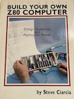
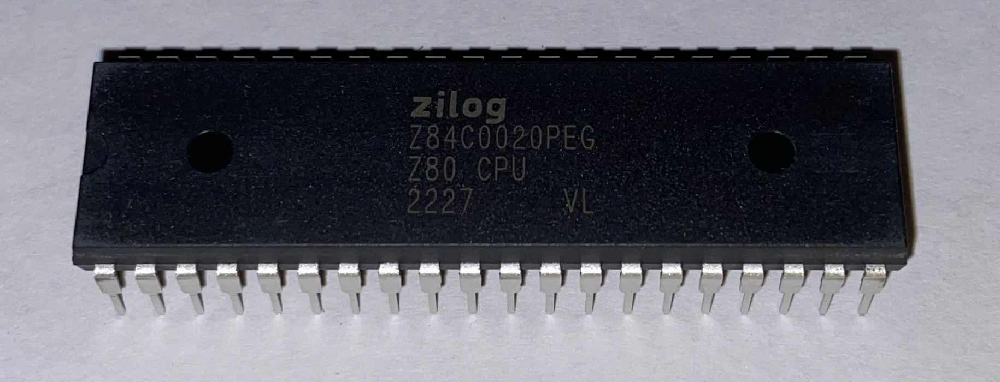
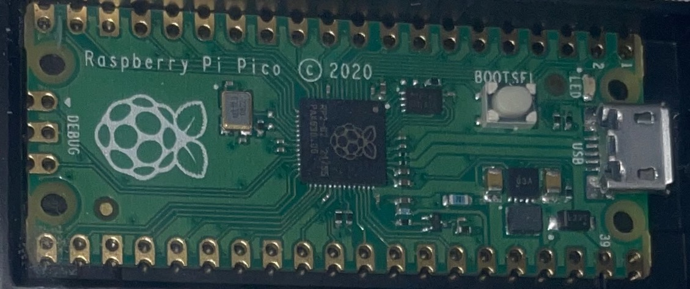
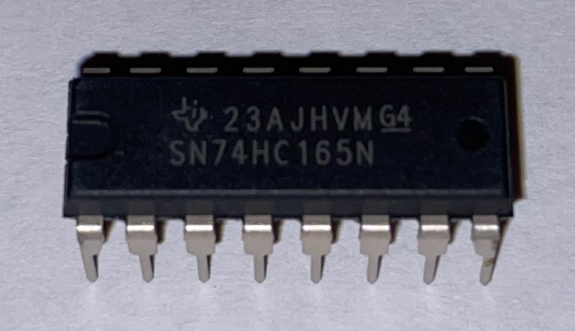
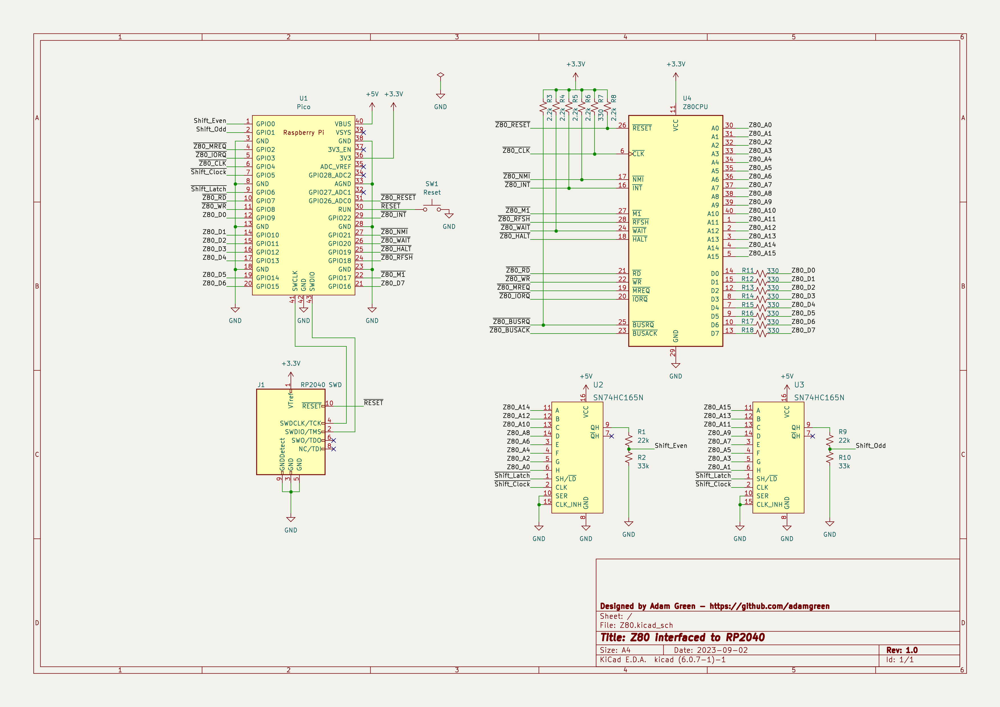

# Z80 Diversion
For now this page is just some notes as I start thinking about a [Z80](https://www.zilog.com/index.php?option=com_product&Itemid=26&task=docs&businessLine=&parent_id=139&familyId=20&productId=Z84C00) based diversion. I will add more substance once I design the PCB and start writing the needed firmware.

## Project Purpose
I want to verify some unit tests which exercise all of the instructions supported by the Z80 microprocessor. These tests can be used to verify Z80 emulation. Having the ability to also runs these tests against real Z80 hardware is desireable as it allows verifying the quality of the tests themselves. A few years ago, I did something similar for the ARMv6-M instruction tests that I wrote for my [pinkySim project](https://github.com/adamgreen/pinkySim).

## Reading List
 
It has been around a decade since I last looked at the Z80 so I had to skim through a few Z80 references to refresh my memory of what it takes to interface this little guy to the outside world. These references included:
* [Build Your Own Z80 Computer by Steve Ciarcia](https://en.wikipedia.org/wiki/Build_Your_Own_Z80_Computer) ([Free PDF](http://www.pestingers.net/pdfs/other-computers/build-your-own-z80.pdf)).
* [Z80 CPU User Manual](https://www.zilog.com/docs/z80/UM0080.pdf)
* [Z80 Product Specification](https://www.zilog.com/docs/z80/ps0178.pdf)
* [Other Official Z80 Documents](https://www.zilog.com/index.php?option=com_product&Itemid=26&task=docs&businessLine=1&parent_id=139&familyId=20&productId=Z84C00)

I also skimmed some RP2040 documentation again as well to make sure that I had a good chance of successfully interfacing it to the Z80 before going too far down that path:
* [Raspberry Pi Pico Datasheet](https://datasheets.raspberrypi.com/pico/pico-datasheet.pdf)
* [RP2040 Datasheet](https://datasheets.raspberrypi.com/rp2040/rp2040-datasheet.pdf)

## High Level BOM
My current plan is to design and implement a simple Z80 based board that can be used to run and verify these unit tests. To that end, I think this board should include:
* A **Z80 Microprocessor** - I am planning to use a [Z84C0020PEG](https://www.digikey.com/en/products/detail/zilog/Z84C0020PEG/928994) device since it is:
  * CMOS Based
  * 5.0V Nominal
  * 20 MHz capable. I picked the fastest CMOS version of the device available to increase the chances that it will work at 3.3V (same as the RP2040) when run at a lower frequency, between 1 and 3.5 MHz.
  * 40-pin DIP package. Currently Digikey only has the DIP version of the 20MHz capable part in stock. I would have preferred the LQFP SMD version but it doesn't look like it will be in stock for awhile. 
* A [RP2040 based Pico](https://www.digikey.com/en/products/detail/raspberry-pi/SC0915/13624793). I want to connect this to the Z80 bus and use it to service Z80 memory requests. My plan is to make it work like a hardware debugger for the Z80. Features of the RP2040 that can be leveraged for this project include:
  * USB 1.1 controller and PHY. This can be used for easy connection to a desktop/laptop. The unit tests can be deployed and verified over this USB connection.
  * 264kB SRAM. This can be the backing store for the 64kB of address space supported by the Z80 while leaving lots around for other fun.
  * 2MB of FLASH. Lots of room for the required firmware and storage of any ROM images that we may want to use with the Z80.
  * Programmable I/O. This will be useful for interfacing with the Z80 bus without bit banging everything from the CPU.
  * Dual core Cortex-M0+ cores. Can dedicate a core to just servicing memory read/writes requests from the Z80 as they are detected and pushed to the CPU by the PIO state machines. This way things like USB interrupts don't slow down processing of Z80 memory requests. 
  * The Pico has the required voltage regulation so that the board can be powered from USB.
* 2 x [SN74HC165 8-bit shift registers](https://www.digikey.com/en/products/detail/texas-instruments/SN74HC165N/376966). These will be used to latch the 16-bit address sent from the Z80 and push it into the RP2040 over 2 serial lines, one for the even bits and the other for the odd bits. Will probably run this chip at 5V and run the serial outputs through a 3/5 voltage divider to make it compatible with the RP2040 while also allowing it to run as close to a 50MHz as possible. It can be run at 3.3V like the RP2040 but its maximum serial clock frequency would then be greatly reduced. 

## Programmable I/O
I plan to leverage the programmable I/O (PIO) peripheral on the RP2040 for interfacing to the Z80 bus. My current thoughts are to use 2 PIO state machines for this interfacing:
* One state machine will generate the main **CLK** signal, samples the **MREQ'** / **IOREQ'** signals and shifts out the 16-bit address bits using two 8-bit shift registers:
  * If it sees either of the **MREQ'** or **IOREQ'** signals go active (pulled low) then it will latch the 16-bit address bits and start shifting out the address, two bits at a time.
  * Once the 16-bit address has been fully shifted in, it will be pushed out into the TX FIFO for the CPU to pick up.
  * It can also issue an IRQ to the second state machine to unblock it as a read/write request is coming soon.
* The other state machine samples the **RD'**/**WR'** signals to determine if a read or write memory transfer is being requested by the Z80:
  * It can block on an IRQ until the first state machine detects an incoming transfer request and sets the matching IRQ.
  * It then keeps sampling the **RD'**/**WR'** signals until it sees one of them go active (pulled low).
  * If a read has been requested then the **WAIT'** signal can be asserted to let the Z80 know that it is waiting for the CPU to access the requested data.
  * The state of the **RD'**/**WR'** lines and **D0** - **D7** are then transferred to the CPU so that between this data and the 16-bit address from the other state machine, the CPU has enough information to process the memory request.
  * If a read was requested then the state machine will wait for the CPU to send back the required 8-bits of data to be asserted onto the **DO** - **D7** signal lines while also de-asserting the **WAIT'** signal.

## Initial Pin Map
The PIO state machines place constraints on some signals as they will need to be mapped to consecutively numbered GPIO pins so that they can be shifted in/out as needed. This is how I think the pins should be mapped based on how I see the various Z80 signals being used by the PIO state machines:
| RP2040 | Z80 / Shift | PIO Pin Group    | Notes |
|--------|-------------|------------------|-------|
| GP0  | Shift_In_Even | Input            | |
| GP1  | Shift_In_Odd  | Input            | |
| GP2  | MREQ'         | Input            | |
| GP3  | IOREQ'        | Input            | |
| GP4  | CLK           | Set              | 330Ω Pull-Up |
| GP5  | Shift_Clock   | Set              | |
| GP6  | Shift_Latch   | Set              | |
| GP7  | RD'           | Input            | |
| GP8  | WR'           | Input            | |
| GP9  | D0            | Input/Output     | |
| GP10 | D1            | Input/Output     | |
| GP11 | D2            | Input/Output     | |
| GP12 | D3            | Input/Output     | |
| GP13 | D4            | Input/Output     | |
| GP14 | D5            | Input/Output     | |
| GP15 | D6            | Input/Output     | |
| GP16 | D7            | Input/Output     | |
| GP17 | M1'           | Input            | |
| GP18 | RFSH'         | Input            | |
| GP19 | HALT'         | Input            | |
| GP20 | WAIT'         | Set              | 2.2kΩ Pull-Up |
| GP21 | NMI'          | Output / Non-PIO | 2.2kΩ Pull-Up |
| GP22 | INT'          | Output / Non-PIO | 2.2kΩ Pull-Up |
| GP26 | RESET'        | Output / Non-PIO | 3 CLK Long Pulse (3µs @ 1MHz) |
| N/C  | BUSREQ'       | Not Connected    | 2.2kΩ Pull-Up |

## Initial Schematic
 
I have started working on the schematic for this project. I want to try initially wiring up most of it up on a breadboard before actually designing a PCB:
* I may need to move some of the signals around on the RP2040 to simplify the PIO code but I won't know until I start writing and testing the PIO code itself.
* I also want to test that the Z80 will run reliably at 3.3V when run at lower clock rates and that the SN74HC165 shift registers can run at 50MHz when running at 5.0V.

## GDB for Z80?
I have past experience with using GDB and GDB debug stubs to debug Cortex-M microcontrollers. Can I leverage this experience by using GDB with the Z80? If so then I could use it for deploying test code to the Z80, single stepping, examining memory and registers, etc. When I tested my ARMv6-M instruction tests on real Cortex-M hardware, I used an existing GDB debug stub and modified my test harness to pretend to be GDB so that it could place required inputs and code into RAM, setup the registers, single step over the test instruction, and then interrogate memory and registers afterwards to verify that the expected side effects occurred.

Can I do the same for the Z80? I found a page on the web which gives me a lot of hope that it can:
* [chciken's TLMBoy: Implementing the GDB Remote Serial Protocol](https://www.chciken.com/tlmboy/2022/04/03/gdb-z80.html)

## Current Project State
The Z80, RP2040 Pico, and SN74HC165 shift register devices have arrived from Digikey and I have completed the initial schematic. I will try implementing it on a breadboard next.

## Next Steps
* Use solderless breadboard for initial testing.
* Use KiCAD to design the required PCB.
* Order PCBs from [OSH Park](https://oshpark.com).
* Receive parts from Digikey.
